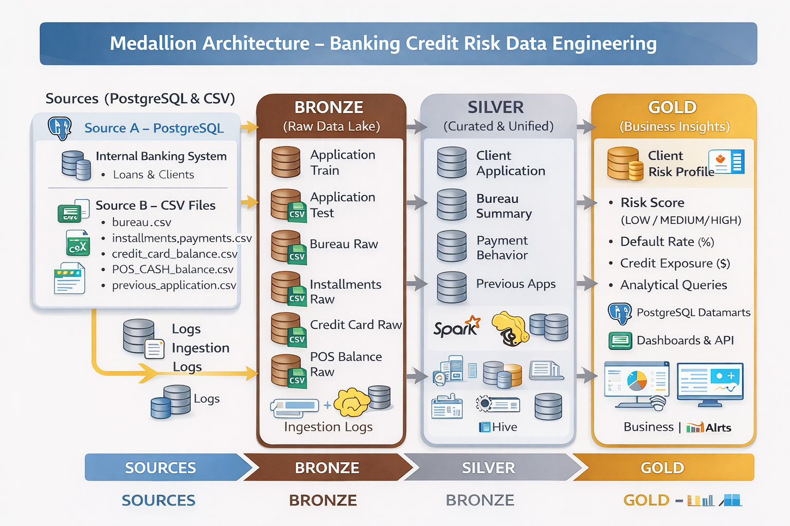

# Home Credit Data Engineering – Credit Risk Lakehouse

Projet d’**analyse du risque de crédit** (dataset Home Credit Default Risk) sur une **architecture Lakehouse Medaillon (Bronze / Silver / Gold)**.



## Architecture

**Sources** (PostgreSQL + fichiers CSV) → **Bronze** (données brutes HDFS) → **Silver** (validation, jointures, agrégations) → **Gold** (KPIs risque, portefeuille) → **Datamarts PostgreSQL** → **API (JWT) + Dashboard Next.js**.

- **Commandes d’exécution :** [run.md](run.md) — ingestion Bronze, Silver, Gold, datamarts (Standalone ou YARN).

## Vérification des tables Gold (PostgreSQL)

Après exécution du Gold processor et chargement des datamarts, les tables du schéma `datamart` dans PostgreSQL contiennent les données agrégées (risque client, portefeuille, bureau, anciennes demandes). Exemple de vérification des effectifs :


## Démarrage rapide

```bash
docker compose up -d
```

Puis suivre [run.md](run.md) pour l’ingestion Bronze, Silver, Gold et le chargement des datamarts.
